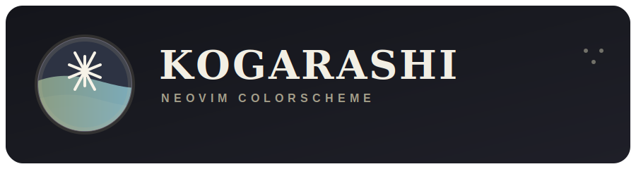
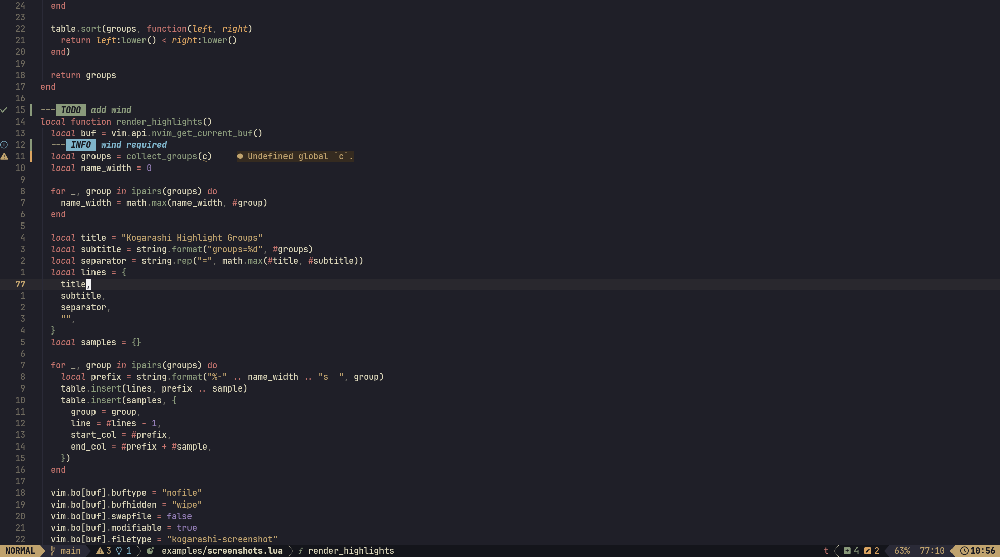

<p align="center">
  <a href="https://github.com/shawilly/kogarashi.nvim/stargazers"></a>
  <a href="https://github.com/shawilly/kogarashi.nvim/issues"></a>
  <a href="https://github.com/shawilly/kogarashi.nvim/contributors"></a>
  <a href="https://github.com/shawilly/kogarashi.nvim/network/members"></a>
</p>

<div align="center">
  <br>
  <a href="https://github.com/shawilly/kogarashi.nvim">
    
  </a>
  <br>
</div>

&nbsp;&nbsp;&nbsp;&nbsp;

<p align="center">
  
  &nbsp;&nbsp;&nbsp;&nbsp;
  
  &nbsp;&nbsp;&nbsp;&nbsp;
  
</p>

<hr/>

<h4 align="center">A winter-leaning Neovim colorscheme with restrained contrast, warm parchment text, and broad plugin coverage.</h4>

<hr/>

```lua
vim.cmd.colorscheme("kogarashi")
```



---

## Theme

Kogarashi is a Neovim colorscheme and Vim theme aimed at daily coding, terminal work, and plugin-heavy setups. It ships with:

- tree-sitter and semantic token highlights
- terminal and devicon integration
- common plugin highlight support
- override hooks for palette, scheme, and final highlight groups

If you want the Vim-first sibling theme, see [shawilly/ponokai](https://github.com/shawilly/ponokai).

## Installation

> [!IMPORTANT]
> For richer syntax coverage, use Kogarashi with `nvim-treesitter` when possible.

### lazy.nvim

```lua
{
  "shawilly/kogarashi.nvim",
  lazy = false,
  priority = 1000,
  opts = {},
  config = function(_, opts)
    require("kogarashi").setup(opts)
    vim.cmd.colorscheme("kogarashi")
  end,
}
```

### LazyVim

Create `lua/plugins/colorscheme.lua`:

```lua
return {
  {
    "shawilly/kogarashi.nvim",
    lazy = false,
    priority = 1000,
    opts = {
      transparent_background = false,
    },
    config = function(_, opts)
      require("kogarashi").setup(opts)
      vim.cmd.colorscheme("kogarashi")
    end,
  },
}
```

### packer.nvim

```lua
use {
  "shawilly/kogarashi.nvim",
  config = function()
    require("kogarashi").setup()
    vim.cmd.colorscheme("kogarashi")
  end,
}
```

### vim-plug

```vim
Plug 'shawilly/kogarashi.nvim'
```

## Plugin Support

Kogarashi includes highlight definitions for common plugins, including:

- `alpha-nvim`
- `aerial.nvim`
- `barbecue.nvim`
- `beacon.nvim`
- `breadcrumb.nvim`
- `bufferline.nvim`
- `dashboard-nvim`
- `diffview.nvim`
- `dropbar.nvim`
- `flash.nvim`
- `fidget.nvim`
- `fzf-lua`
- `gitsigns.nvim`
- `harpoon`
- `hop.nvim`
- `indent-blankline.nvim`
- `lazy.nvim`
- `leap.nvim`
- `mason.nvim`
- `mini.nvim`
- `neo-tree.nvim`
- `neogit`
- `noice.nvim`
- `nvim-cmp`
- `nvim-dap`
- `nvim-dap-ui`
- `nvim-navic`
- `nvim-notify`
- `nvim-tree.lua`
- `nvim-treesitter`
- `rainbow-delimiters.nvim`
- `render-markdown.nvim`
- `snacks.nvim`
- `telescope.nvim`
- `todo-comments.nvim`
- `toggleterm.nvim`
- `trouble.nvim`
- `ufo`
- `which-key.nvim`
- `wilder.nvim`

## Configuration

Example configuration:

```lua
require("kogarashi").setup({
  transparent_background = false,
  terminal_colors = true,
  devicons = true,
  styles = {
    comment = { italic = true },
    keyword = { italic = true },
    type = { italic = true },
    storageclass = { italic = true },
    structure = { italic = true },
    parameter = { italic = true },
    annotation = { italic = true },
    tag_attribute = { italic = true },
  },
  inc_search = "background",
  background_clear = {
    "toggleterm",
    "telescope",
    "renamer",
    "notify",
  },
  lazy_plugins = false,
  enabled_plugins = nil,
  plugins = {
    bufferline = {
      underline_selected = false,
      underline_visible = false,
      underline_fill = false,
      bold = true,
    },
    indent_blankline = {
      context_highlight = "default",
      context_start_underline = false,
    },
  },
  override = function(c)
    return {}
  end,
  overridePalette = function()
    return {}
  end,
  overrideScheme = function(cs, palette, config, hp)
    return {}
  end,
})
```

### Background-Clear Example

```lua
require("kogarashi").setup({
  background_clear = { "float_win" },
})

require("cmp").setup({
  window = {
    border = "rounded",
  },
  completion = {
    border = "rounded",
  },
})
```

### Telescope Border Example

```lua
require("kogarashi").setup({
  background_clear = {},
})

require("telescope").setup({
  defaults = {
    borderchars = { "█", " ", "▀", "█", "█", " ", " ", "▀" },
  },
})
```

### Palette Override Example

```lua
require("kogarashi").setup({
  overridePalette = function()
    return {
      dark2 = "#101014",
      dark1 = "#16161e",
      background = "#1a1b26",
      text = "#c0caf5",
      red = "#f7768e",
      orange = "#ff9e64",
      yellow = "#e0af68",
      green = "#9ece6a",
      blue = "#0db9d7",
      purple = "#9d7cd8",
      dimmed1 = "#a9b1d6",
      dimmed2 = "#787c99",
      dimmed3 = "#565f89",
      dimmed4 = "#414868",
      dimmed5 = "#24283b",
    }
  end,
})
```

### Scheme Override Example

```lua
require("kogarashi").setup({
  overrideScheme = function(cs, palette, config, hp)
    local background = hp.blend(palette.background, 0.75, "#000000")
    return {
      editor = {
        background = background,
      },
    }
  end,
})
```

## Usage

### Colorscheme

```vim
colorscheme kogarashi
```

```lua
require("kogarashi").setup({})
vim.cmd.colorscheme("kogarashi")
```

### lualine

```lua
require("lualine").setup({
  options = {
    theme = "kogarashi",
  },
})
```

### barbecue.nvim

```lua
require("barbecue").setup({
  theme = "kogarashi",
})
```

### lightline

```vim
let g:lightline = { 'colorscheme': 'kogarashi' }
```

## Links

- Vim help: [`doc/kogarashi.txt`](doc/kogarashi.txt)
- Screenshot helper: [`examples/screenshots.lua`](examples/screenshots.lua)
- Vim sibling theme: [shawilly/ponokai](https://github.com/shawilly/ponokai)
